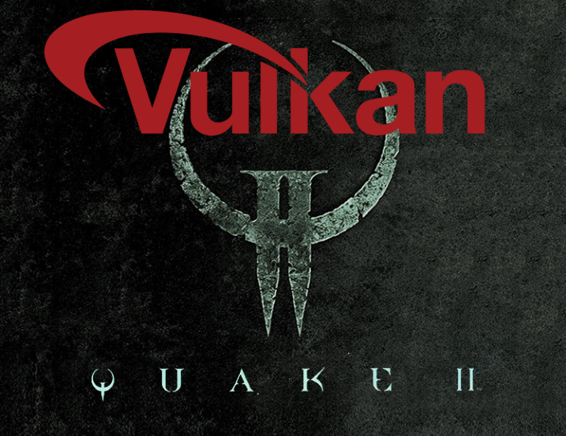

# vkQuake2 - vanilla Quake 2 with Vulkan support

Setup:
===
- install Visual Studio 2017 Community (because of MFC and resources)
- install MFC package in Visual Studio Installer
- install Windows Universal CRT SDK and Windows SDK 8.1, alternatively install only any latest Windows 10 SDK and retarget the solution to build

Original code changes:
===
- fixed compiler warnings
- Calling M_DrawTextBox properly without using explicit endframe calls (required for Vulkan)
- added custom debug Windows console for debug builds
- added 1920x1080 screen resolution
- warped texture effect (liquids) is properly drawn with Vulkan renderer

Console commands:
===

|                       |                                                         |
|-----------------------|:--------------------------------------------------------|
| vk_validation         | Toggle validation layers. 0 - disabled (default in Release)  1 - only errors and warnings 2 - full validation (default in Debug) |
| vk_strings            | Print some basic Vulkan/GPU information.                                    |
| vk_msaa               | Toggle MSAA. 0 - off (default) 1 - MSAAx2 2 - MSAAx4 3 - MSAAx8 |
| vk_flashblend         | Toggle the blending of lights onto the environment. (default: 0)            |
| vk_polyblend          | Blend fullscreen effects: blood, powerups etc. (default: 1)                 |
| vk_skymip             | Toggle the usage of mipmap information for the sky graphics. (default: 0)   |
| vk_finish             | Inserts vkDeviceWaitIdle() on render start (default: 0). Don't use this, it's just for the sake of having a gl_finish equivalent. |
| vk_point_particles    | Use POINT_LIST to render particles, textured triangles otherwise. (default: 1) |
| vk_particle_size      | Rendered particle size. (default: 40)                   |
| vk_particle_att_a     | Intensity of the particle A attribute. (default: 0.01)  |
| vk_particle_att_b     | Intensity of the particle B attribute. (default: 0)     |
| vk_particle_att_c     | Intensity of the particle C attribute. (default: 0.01)  |
| vk_particle_min_size  | The minimum size for a rendered particle. (default: 2)  |
| vk_particle_max_size  | The maximum size for a rendered particle. (default: 40) |
| vk_lockpvs            | Lock current PVS table. (default: 0)                    |
| vk_modulate           | Texture brightness modifier. (default: 1)               |
| vk_shadows            | Draw experimental entity shadows. (default: 0)          |
| vk_picmip             | Shrink factor for the textures. (default: 0)            |
| vk_round_down         | Toggle the rounding of texture sizes. (default: 1)      |
| vk_log                | Log frame validation data to file. (default: 0)         |
| vk_dynamic            | Use dynamic lighting. (default: 1)                      |
| vk_showtris           | Display mesh triangles. (default: 0)                    |
| vk_lightmap           | Display lightmaps. (default: 0)                         |
| vk_texturemode        | Change current texture filtering. VK_NEAREST - nearest filter, no mipmaps VK_LINEAR - linear filter, no mipmaps VK_MIPMAP_NEAREST - nearest filter with mipmaps VK_MIPMAP_LINEAR - linear filter with mipamps (default) |

Features:
===
- using Vulkan 1.1
- using VK_EXT_debug_utils instead of VK_EXT_debug_report
- updated with Knightmare software renderer with color
- skipped 8-bit textures - no modern hardware even supports it these days

TODO:
==
- implement screenshots
- implement water warp effect
- implement vk_clear
- add music
- use push constants
- Linux and MacOS versions
